**English** | [简体中文](README_zh.md) | [Türkçe](README_tr.md) | [Русский](README_RU.md)

 

  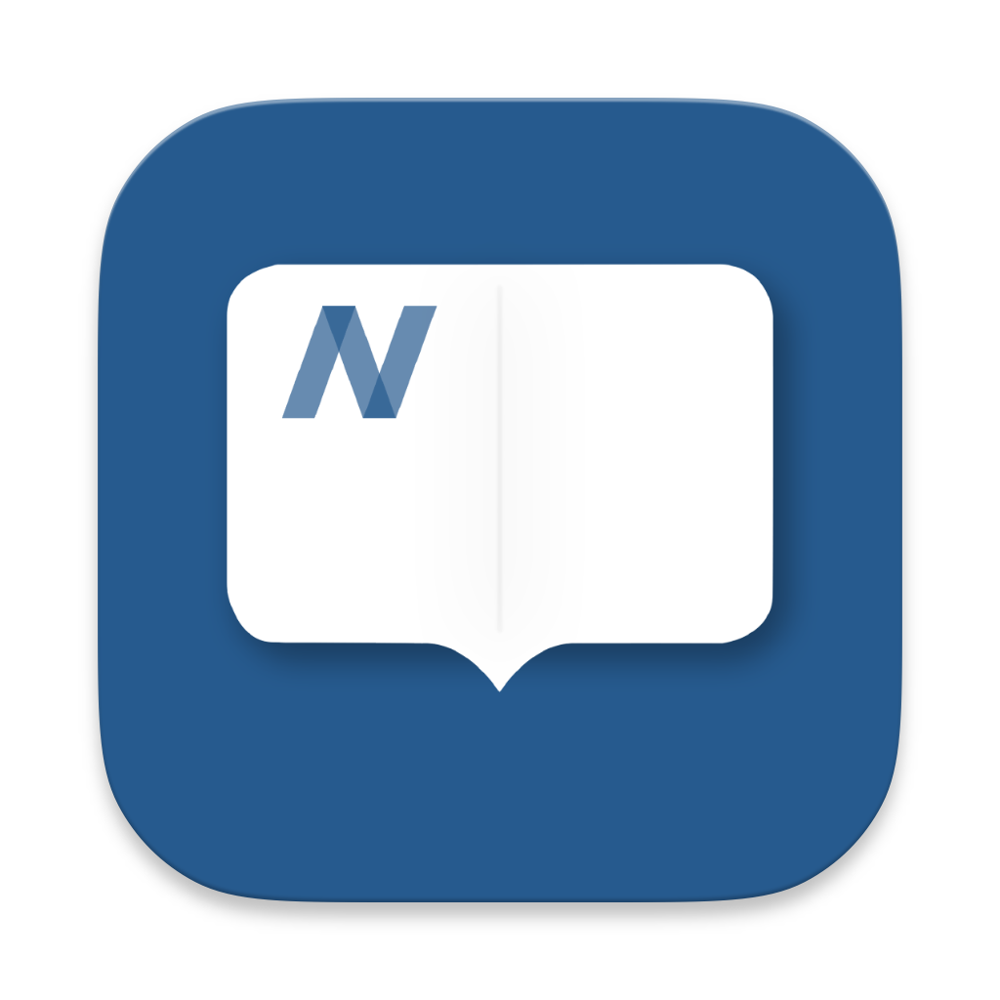

<h1 align="center">Anx Reader AI</h1>

  
  

  
  
  
  
  

Anx Reader AI — продуманная независимая читалка электронных книг для любителей чтения. Оснащена мощными возможностями искусственного интеллекта и поддерживает различные форматы электронных книг, делая чтение умнее и сосредоточеннее. Благодаря современному дизайну интерфейса мы стремимся подарить вам чистое удовольствие от чтения.

| Раздел | Описание | Статус |
| --- | --- | --- |
| Поддержка форматов | EPUB/MOBI/AZW3/FB2/TXT/PDF полностью поддерживаются | ✅ |
| Кроссплатформенная синхронизация | Android/iOS/macOS/Windows охват Синхронизация книг, заметок и прогресса через WebDAV | ✅ |
| ИИ-ассистент | Упорядочивает книжные полки по прогрессу и настроению Строит интеллект-карты для глубокого понимания ИИ-словарь и мгновенный перевод Проводит анализ точек зрения и готовит дайджесты | ✅ |
| Настраиваемое чтение | Регулировка межбуквенного, межстрочного, межабзацного интервалов и полей Настройка размера, начертания и насыщенности шрифта Выбор тем, фоновых изображений, выравнивания и пользовательских стилей | ✅ |
| Работа с заметками | Цветовые и стилевые пресеты Сортировка по времени или главе с фильтром по цвету Экспорт в TXT/Markdown/CSV Создание опрятных карточек для обмена | ✅ |
| Аналитика чтения | Отслеживает время чтения Статистика по дням/неделям/месяцам/годам Тепловая карта, показывающая привычки чтения | ✅ |
| Расширенные возможности | TTS с выбором голосов, скоростью, тембром и таймером сна Полный перевод книги с параллельным отображением Хранение книг в облаке с выборочной загрузкой Мгновенное переключение между упрощённым и традиционным китайским | ✅ |
| OPDS-каталоги | Поддержка OPDS и добавление собственных каталогов | 🛠️ В работе |

<table border="1">
  <tr>
    <th>ОС</th>
    <th>Ссылка</th>
  </tr>
  <tr>
    <td>iOS</td>
    <td>
      <a href="https://github.com/zym20192019/anx-reader-ai/releases/latest" target="_blank">GitHub Release (unsigned IPA; local signing required)</a>
    </td>
  </tr>
  <tr>
    <td>macOS</td>
    <td>
      
    </td>
  </tr>
  <tr>
    <td>Windows</td>
    <td>
      
    </td>
  </tr>
  <tr>
    <td>Android</td>
    <td>
      
      <a href="https://github.com/zym20192019/anx-reader-ai/releases/latest" target="_blank">GitHub Release</a>
    </td>
  </tr>
</table>

### Возникла проблема? Что делать?
Проверьте раздел [Устранение неполадок](./docs/troubleshooting.md#English)

Создайте [issue](https://github.com/zym20192019/anx-reader-ai/issues/new/choose), и мы ответим как можно скорее.

Группа в Telegram: [https://t.me/AnxReader](https://t.me/AnxReader)

Группа в QQ: 1042905699

### Скриншоты
| 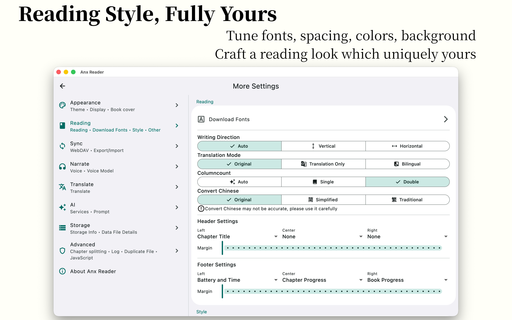 |  |
| :------------------------------: | :----------------------------: |
|      |  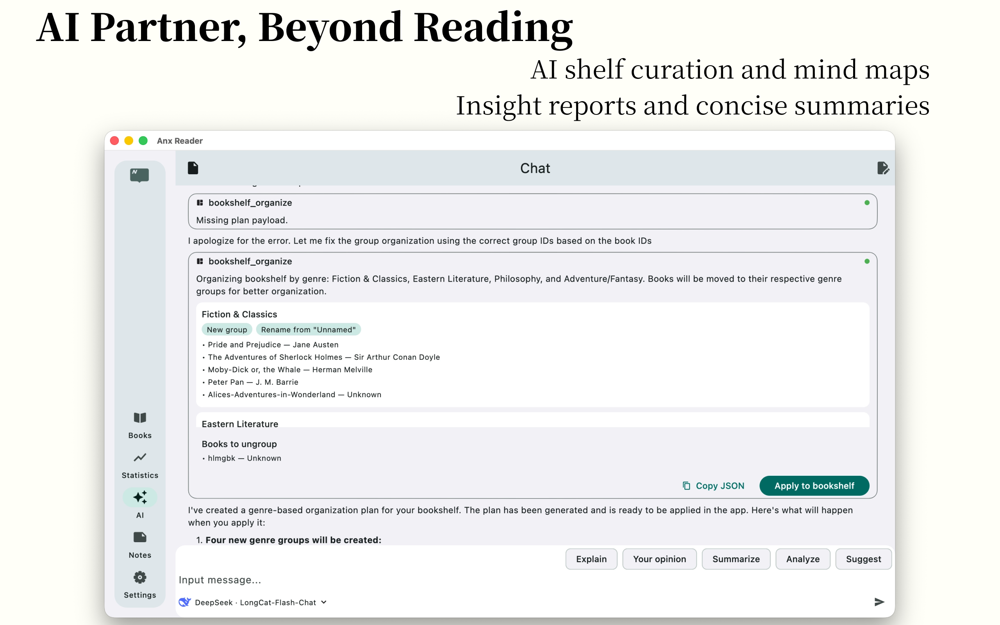  |
|   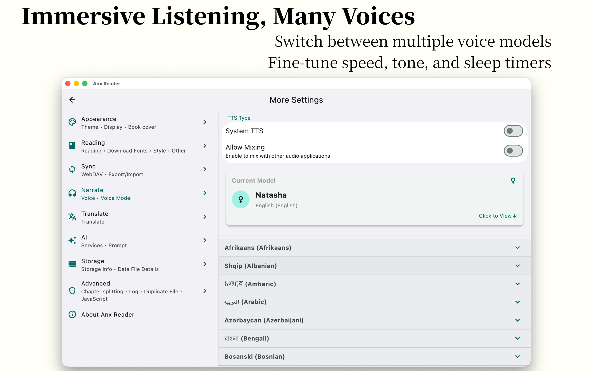   |    |
|   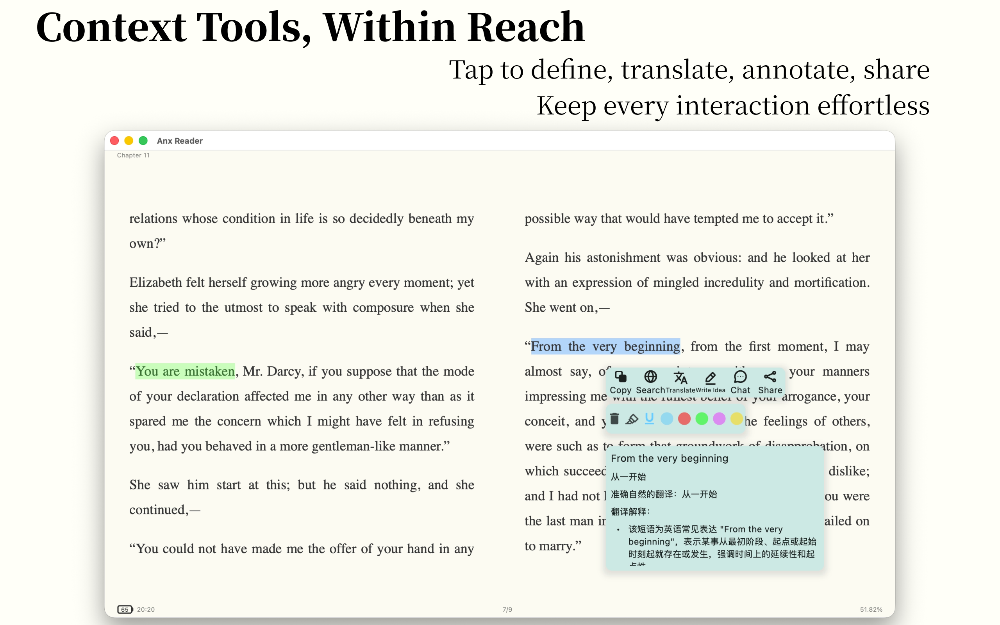   |  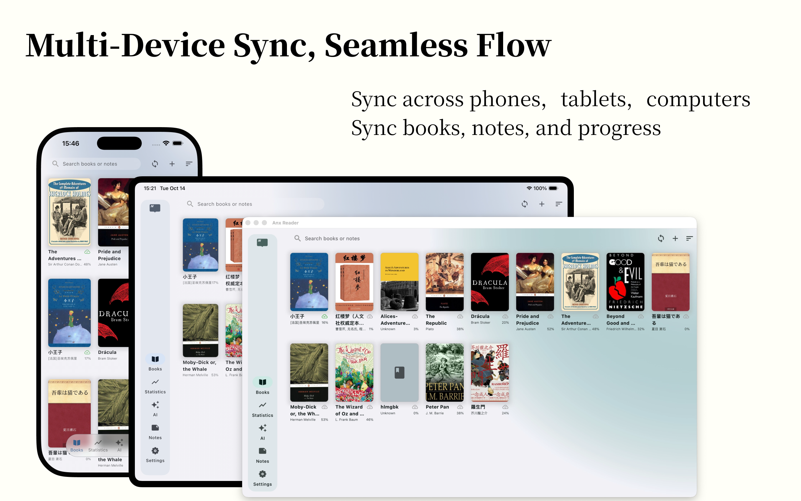  |

|  | 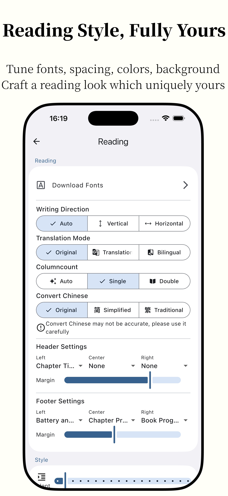 | 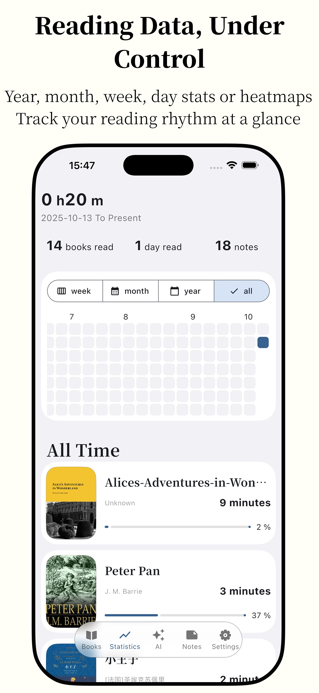 |
| :----------------------------: | :----------------------------: | :----------------------------: |
| 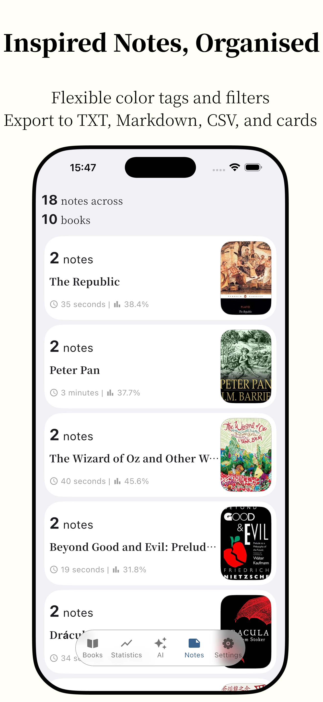 | 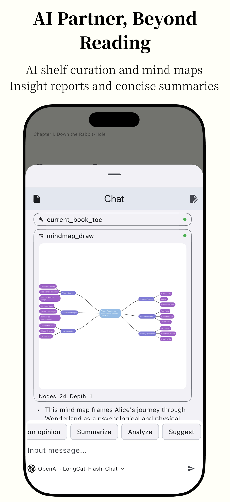 | 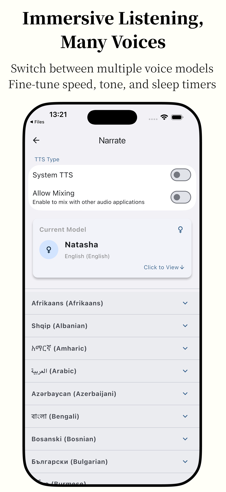 |
|  | 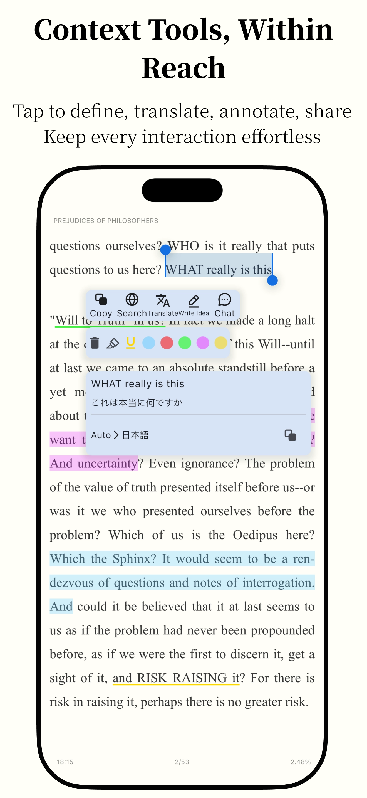 | 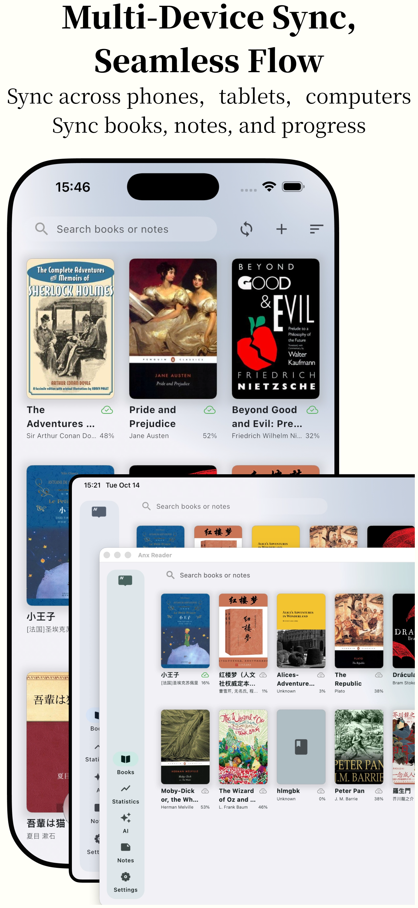 |

## Пожертвования
Если вам нравится Anx Reader, пожалуйста, рассмотрите возможность поддержки проекта пожертвованиями. Ваша помощь поможет поддерживать и развивать проект.

❤️ [Пожертвовать](https://github.com/zym20192019/anx-reader-ai)

## Сборка
Хотите собрать Anx Reader из исходников? Пожалуйста, выполните следующие шаги:
- Установите [Flutter](https://flutter.dev).
- Клонируйте репозиторий и перейдите в каталог проекта.
- Выполните `flutter pub get`.
- Выполните `flutter gen-l10n` для генерации файлов мультиязычности.
- Выполните `dart run build_runner build --delete-conflicting-outputs` для генерации кода Riverpod.
- Запустите приложение командой `flutter run`.

Возможно, вы столкнётесь с проблемами совместимости версий Flutter. Пожалуйста, ознакомьтесь с [документацией Flutter](https://flutter.dev/docs/get-started/install).

## Политика подписания кода
- Коммитеры и рецензенты: [Команда участников](https://github.com/zym20192019/anx-reader-ai/graphs/contributors)
- Утверждающие: [Сопровождающие проекта](https://github.com/zym20192019/anx-reader-ai/graphs/contributors)
- [Privacy policy](https://github.com/zym20192019/anx-reader-ai/blob/main/docs/privacy.md)
- [Terms of use](https://github.com/zym20192019/anx-reader-ai/blob/main/docs/terms.md)

### Спонсоры
Независимое кодовое подписание для этого проекта не настроено; релизные артефакты помечены как unsigned.

## Лицензия
Этот проект лицензирован под [MIT License](./LICENSE).

Начиная с версии 1.1.4, лицензия проекта Anx Reader была изменена с MIT License на GNU General Public License версии 3 (GPLv3).

После версии 1.2.6 функция выделения и подсветки была переписана, и лицензия была изменена с GPL-3.0 на MIT License. Все участники согласны с этим изменением (#116).

## Благодарности
[foliate-js](https://github.com/johnfactotum/foliate-js), лицензированный по MIT, используется в качестве рендерера электронных книг. Спасибо автору за отличный проект.

[foliate](https://github.com/johnfactotum/foliate), лицензированный по GPL-3.0, вдохновил функцию выделения и подсветки. Начиная с версии 1.2.6, эта функция была переписана.

И многим [другим open source проектам](./pubspec.yaml), спасибо всем авторам за их вклад.
